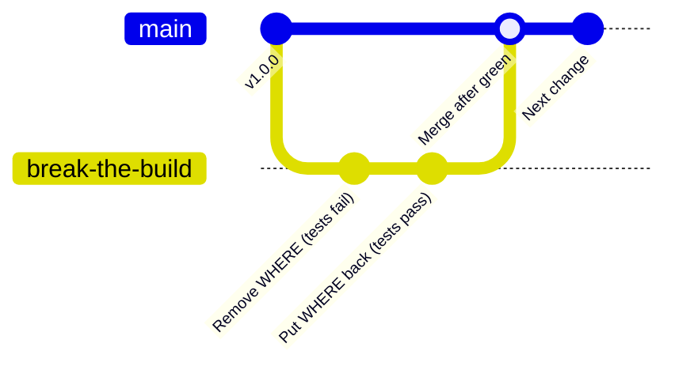

# Branching

`main` is always deployable. Every change goes on a short-lived branch and comes back through a pull request.

```mermaid
gitGraph
    commit id: "v1.0.0"
    branch break-the-build
    checkout break-the-build
    commit id: "Remove WHERE (tests fail)"
    commit id: "Put WHERE back (tests pass)"
    checkout main
    merge break-the-build id: "Merge after green"
    commit id: "Next change"
```
