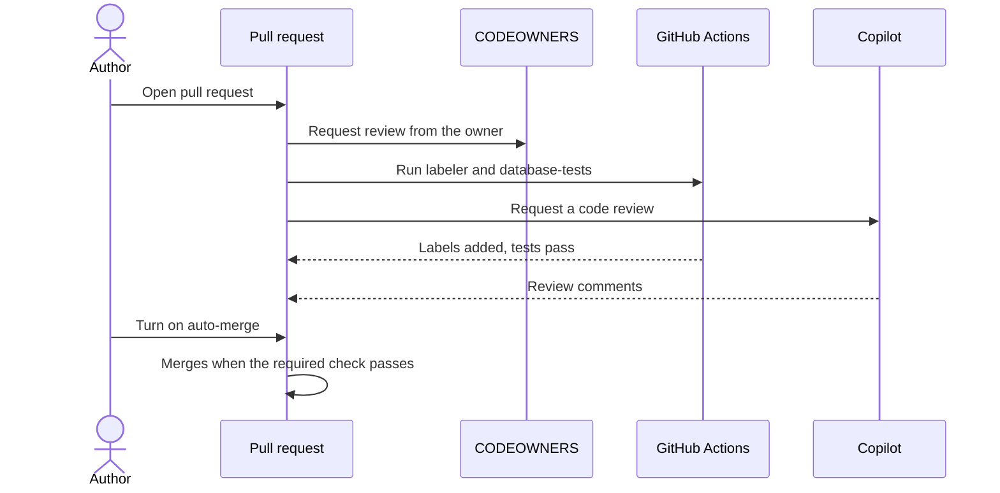

# Pull request flow

What happens after you open a pull request. Most of it runs by itself.

```mermaid
sequenceDiagram
    actor Author
    participant PR as Pull request
    participant Owners as CODEOWNERS
    participant Actions as GitHub Actions
    participant Copilot
    Author->>PR: Open pull request
    PR->>Owners: Request review from the owner
    PR->>Actions: Run labeler and database-tests
    PR->>Copilot: Request a code review
    Actions-->>PR: Labels added, tests pass
    Copilot-->>PR: Review comments
    Author->>PR: Turn on auto-merge
    PR->>PR: Merges when the required check passes
```
